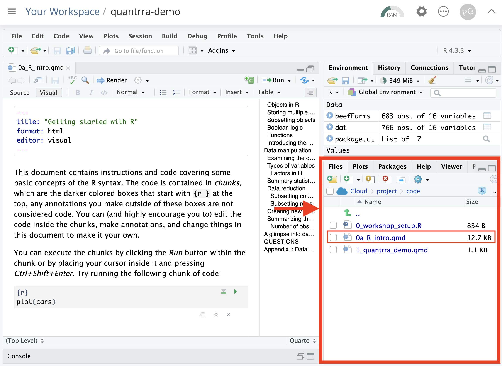

# Posit Cloud

In this workshop we will be using posit cloud, which is a web based platform to use R without the need of installing any software. All the concepts covered in this workshop are directly transferable to R and Rstudio. *If you already have familiarity with R and R studio you are welcome to use it, but make sure you have R version > 4.3.*

Follow [this link](https://posit.cloud) to go to the posit homepage. If you don't have an account yet, click on sign up and follow the instructions to create a free account. You can either create an account or link it with a google/gmail account if you already have one.  

{style="width:60%" fig-align="center"}

{style="width:60%" fig-align="center"}

{style="width:60%" fig-align="center"}
  
  
If you are able to see the following dashboard you are all set and ready to start the workshop!
  
{style="width:60%" fig-align="center"}

-------

# Making a local copy of the workshop

To save some time on set up and installation of libraries, I set up an starting point for the workshop materials in [THIS LINK](https://posit.cloud/content/7817019). When you follow the link, and if you are logged into your posit account, it will show you the following posit project:

{fig-align="center"}

This is a temporary copy, so make sure you save a permanent copy using the option highlighted in red in the previous image.

# The interface

When we start R Studio, we can see 4 sections:

1.  **Source** (top left), here we have our code editor and other files. We will use this section to edit and view our scripts and other documents we will be using to interact with R.
2.  **Console and Terminal** (bottom left), this is where the code is executed (*Console* will execute R code and *Terminal* other code for your operating system). We can directly write the code here, but normally we will be using the other source files such as .R or .Rmd to write our code which then will be send here.\
3.  **Environment, History and others** (top right), Environment will list all the objects you create and History will have the code you sent to the console. There are other tabs in this section which we wont be using for now.
4.  **Files, Packages and Help** (bottom right). This section includes a file browser, and other tabs for package management and help.

As you will notice, the file section is already populated with some directories that I created to organize the project. In this workshop we will NOT cover any topics on project organization or the interface in detail, if you want to learn more, have a look at [this other tutorial](https://www.spablo-temporal.network/DataViz-workshop/0a_Intro_RstudioMarkdown.html).

# R syntax

For this workshop we will base our code in the [tidyverse styling](https://style.tidyverse.org/index.html). For a review on some introductory concepts to R and the tidyverse syntax, we included a file inside the `code/` directory of this posit cloud project. You can access it by using the files panel to navigate to `code/0a_R_Intro.qmd` try to go trough the file for the workshop.

